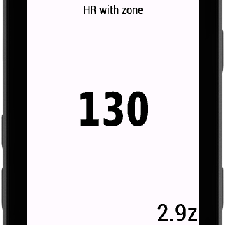
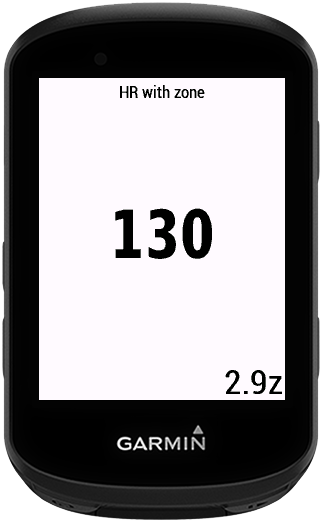
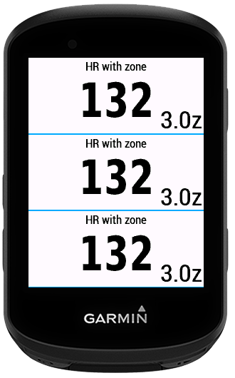
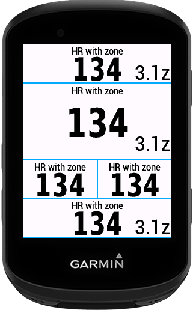

# Garmin Data field HR With Zone

This Data Filed displays current Heart Rate and Zone in one data field.
If data field is too small, then it only displays the current Heart Rate without zone.

## What’s New

1.0.0 - Initial version

## Screenshots

